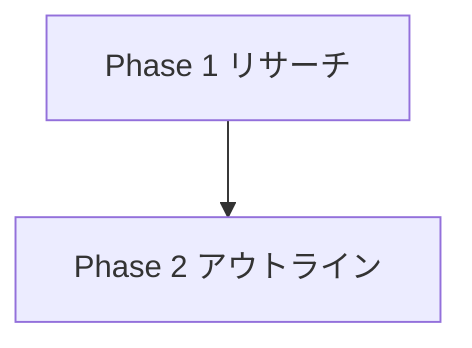

# Zenn プラットフォーム仕様

Zenn（https://zenn.dev）で記事を公開する際の仕様・記法・制約をまとめたリファレンス。
**Phase 5（テクニカル）で Zenn を出力先に選んだ場合、JSON-LD の手動生成は行わない**。Zenn 側が構造化データ・OGP・sitemap を自動生成するため、Phase 5 の作業は「Zenn 形式への変換」に置き換わる。

参考: [Zenn でテックブログを書く方法](https://zenn.dev/tsukulink/articles/2025-07-how-to-write-techblog-with-zenn) / [Zenn 公式ドキュメント](https://zenn.dev/zenn)

## 最重要の制約

> Zenn は**生成 AI に記事を生成させて量産する行為を禁止**している。

本リポジトリのワークフローは「リサーチ・構造化・校正の支援」であり、**最終的な文章は人間が自分の言葉として責任を持つこと**を前提とする。AI が生成した草稿をそのまま published: true にしてはならない。Phase 4（レビュー）と、公開前の人間による最終確認を必ず経由する。

## ディレクトリ構造

Zenn の GitHub 連携はリポジトリルートの `articles/` と `images/` を見る。本リポジトリでは `zenn/` をルートとして扱う（Zenn 側のデプロイ設定で `zenn/` をルートディレクトリに指定する）。

```
zenn/
├── articles/
│   └── <slug>.md               記事本体（1 ファイル = 1 記事）
├── images/
│   └── <yyyy-mm>/              月別に画像を整理
│       └── <name>.png
├── package.json                zenn-cli / textlint / markdownlint（pnpm）
├── pnpm-lock.yaml
├── .textlintrc.json            日本語校正ルール
└── .markdownlint-cli2.jsonc    Markdown 構文ルール
```

## slug（ファイル名 = URL）

- 記事の URL は `https://zenn.dev/<publication または user>/articles/<slug>`
- **半角英小文字・数字・ハイフン `-`・アンダースコア `_` のみ、12〜50 文字**
- 命名規約（本リポジトリ）: `yyyy-mm-<topic-kebab-case>`（例: `2026-07-geo-seo-for-zenn`）
- 公開後の slug 変更は URL が変わるため行わない

## Frontmatter

Phase 5（Zenn）が出力する標準形。**必須フィールドのみを書き、任意フィールドは使う場合だけ追加する**（空の `publication_name` や、`published: false` のままの `published_at` を残さない）。

```yaml
---
title: "記事タイトル"          # 必須。全角 60 文字以内を推奨
emoji: "🌊"                   # 必須。絵文字 1 文字（アイキャッチに使われる）
type: "tech"                  # 必須。"tech"（技術記事）または "idea"（アイデア・ポエム）
topics: ["typescript", "nextjs", "geo"]  # 必須。最大 5 件
published: false              # 公開フラグ。人間の最終確認を経るまで false
---
```

| フィールド | 要否 | ルール |
|---|---|---|
| `title` | 必須 | 検索・SNS で最初に読まれる。結論または具体的な数値を含める。煽り表現は使わない |
| `emoji` | 必須 | 1 文字のみ。合字（👨‍👩‍👦 等）や複数指定は不可 |
| `type` | 必須 | 技術的な手順・検証・コードを含むなら `tech`、考察・意見中心なら `idea` |
| `topics` | 必須 | **最大 5 件**。英数小文字が無難（記号・スペース不可）。Zenn 上の既存トピック名に合わせると流入が増える |
| `published` | 必須 | Phase 5 完了時点では **必ず `false`**。人間が確認して手動で `true` にする |
| `publication_name` | 任意 | Publication に投稿する場合のみ記載する。**空文字を残さない**（キーごと省く） |
| `published_at` | 任意 | 予約投稿する場合のみ記載する。`published: true` と併用し、未来日時を指定する。`published: false` のまま残さない |

任意フィールドを使う場合の例（人間が公開判断をしたあとの状態）:

```yaml
---
title: "記事タイトル"
emoji: "🌊"
type: "tech"
topics: ["typescript", "nextjs", "geo"]
published: true
publication_name: "your_publication"
published_at: "2026-07-20 09:00"
---
```

## Zenn 独自の Markdown 記法

正典は [Zenn の Markdown 記法一覧](https://zenn.dev/zenn/articles/markdown-guide)。**本節と公式ドキュメントが食い違った場合は公式が優先する。**

GEO 観点では、これらは「AI が構造を判別しやすいセマンティックなブロック」として機能する。多用せず、意味に合致するときだけ使う。

### メッセージ

```markdown
:::message
補足情報・前提条件
:::

:::message alert
注意・破壊的な操作の警告
:::
```

### アコーディオン（折りたたみ）

長文の技術記事では、**「結論＋詳細」パターン**として使う。各セクションの冒頭に結論を地の文で置き、それを支える表・導出・全文データを `:::details` に畳む。読者は結論だけを追って読み進められ、必要なときだけ根拠を開ける。

```markdown
## モデルを大きくすれば、精度は上がるのか？

**上がりませんでした。** 本体パラメータを約 2.8 倍にしたところ、
意図分類正解率は 91.11% → 87.78% に下がりました。

:::details 実験 A の測定値
| モデル | 本体パラメータ | 意図分類正解率 |
| ------ | ------------- | ------------- |
| tiny-30m | 1,625,280 | 91.11% |
| small-43m | 4,527,616 | 87.78% |
:::
```

**折りたたんでよいもの**:

- 根拠のデータ表・測定値の全指標・導出の計算過程
- スキーマ全文・設定ファイル・長いログ
- 背景説明・業界動向・補足的な機序の解説

**絶対に折りたたんではならないもの**:

- **セクションの結論**（`:::details` の外に地の文で置く）
- **`:::message` / `:::message alert` による留保・警告**。読み飛ばされると記事の主張が誤って伝わる
- **限界・未検証事項のリスト**

理由: 折りたたんだ内容は `<details>` 要素として HTML には存在するが、AI 検索エンジンが回答を組み立てる際に「主張」と「その裏付け」が切り離されやすい。**主張は必ず開いた状態で、数値付きで言い切る**（Write to be quoted）。

**ネストする場合は外側のコロンを 1 つ増やす**（`:::` → `::::`）:

```markdown
::::details タイトル
:::message
ネストされた要素
:::
::::
```

### コードブロック（ファイル名・差分表示）

````markdown
```ts:src/lib/geo.ts
export const score = (article: Article) => ...
```

```diff ts:src/lib/geo.ts
-const score = 0
+const score = calculate(article)
```
````

- ファイル名を必ず付ける（`言語:ファイル名`）。AI がコードの文脈（どのファイルの話か）を把握できる
- diff は `` ```diff 言語:ファイル名 `` の順。**言語名の前に `diff`、間は半角スペース**
- **diff 内は全行の行頭に `+` `-` `>` `<` または半角スペースが必要**。無印の行があると正しく描画されない

### 図（Mermaid）

````markdown

````

画像より Mermaid を優先する。テキストなので AI が読み取れる。ただし Zenn 側に制約がある。

| 制約 | 内容 |
|---|---|
| 文字数 | **1 ブロックあたり 2,000 文字以内** |
| Chain 数 | `&` による連結は **10 以下** |
| クリックイベント | 無効化されている（`click` 構文は動作しない） |

長大なフローは複数ブロックに分割するか、表に置き換える。

### 数式（KaTeX）

```markdown
インライン: $a\ne0$

$$
E = mc^2
$$
```

**`$$` の前後は空行にする。** 空行がないと正しく埋め込まれないことがある。

### 脚注

```markdown
脚注の例[^1]です。インライン^[脚注の内容その 2]でも書けます。

[^1]: 脚注の内容その 1
```

**GEO 観点では使わない。** 脚注は本文の主張から物理的に切り離されるため、`:::details` と同じ問題を持つ。補足は本文中の括弧か `:::message` に書く。引用元は必ずインラインリンクにする。

### テーブル

```markdown
| Head | Head |
| ---- | ---- |
| Text | Text |
```

**セル内の改行は `<br>` タグを使う。** セル内に長文を書かず、説明は表の前後の地の文に置く（GEO 執筆ルール）。

### インラインコメント

```markdown
<!-- TODO: ◯◯について追記する -->
```

公開ページには表示されない。**複数行のコメントには対応していない**（1 行ごとに `<!-- -->` で囲む）。

### リンクカード・埋め込み

**URL を単独の行に置くと、意図せずカード展開される。** これは記法ではなく Zenn の自動変換であり、避けたい場合も意識する必要がある。

```markdown
https://zenn.dev/zenn/articles/markdown-guide

@[card](https://example.com)
@[tweet](https://x.com/user/status/123)
@[youtube](VIDEO_ID)
@[gist](https://gist.github.com/user/id)
@[codepen](https://codepen.io/user/pen/id)
@[speakerdeck](SLIDE_ID)
@[figma](共有リンクの URL)
```

**引用元は必ずインラインリンク `[ソース名](URL)` にする。** カードは文中の主張と切り離されるため、AI が引用元として結び付けにくい。**URL を裸で行頭に置いてはならない**（自動でカード化される）。

- URL に**アンダースコア `_` を含む**場合、素の URL 行ではカード化されない。カードにしたいときは `@[card](URL)` か `<URL>` を使う
- X（Twitter）の URL も、`_` を 2 個以上含む場合は `@[tweet](URL)` 形式にする
- GitHub のコードは行指定できる: `https://github.com/user/repo/blob/main/foo.ts#L1-L3`

### 画像

```markdown

*図 1: 5 フェーズの遷移*
```

- パスは `/images/` から始める（`zenn/images/` がルート）
- **Alt text は必須**。画像の内容を説明する文にする（「画像」「スクショ」は不可）
- キャプションは画像の**直後の行**にイタリック `*キャプション*` で置く
- 幅指定は **URL の後に半角スペース**を空けて `=幅x`: ``
- 画像にリンクを張る: `[](リンクURL)`

## 記事構成のテンプレート

Zenn の技術記事で読まれる標準構成。本リポジトリの GEO 執筆ルール（結論ファースト・モジュール構造）と整合する。

```markdown
（導入 2-3 文: 誰の何の問題を、この記事がどう解決するか。結論を先に書く）

## 対象読者 / この記事でわかること
- 箇条書き 3 点

## 結論
（先に答えを書く。詳細は以降のセクション）

## <質問ベースの H2 見出し>
（200-300 語のモジュール。主張 → データ → 示唆）

## <質問ベースの H2 見出し>

## まとめ
（箇条書きで要点を再掲）

## 参考リンク
- [ソース名](URL)
```

- **目次は Zenn が H2/H3 から自動生成する**ため、手動で目次を書かない
- H1（`#`）は使わない。frontmatter の `title` が H1 になる
- 見出しは H2 から始める（Zenn 公式もアクセシビリティ観点で H2 起点を推奨している）

## 可読性のルール（読み手が長文で脱落しないために）

GEO 執筆ルール（結論ファースト・質問ベース見出し）を満たしていても、**人間が読み通せない記事になることがある**。Zenn は長文の技術記事が読まれる場だが、それは「読み飛ばせる構造」があってこそ成り立つ。

### 見出し

- **短い質問形にする。副題（`— ...`）を付けない。**
  - 悪い例: `## そもそも何をやらせたのか？ — 「9 意図の意図分類 + 関数呼び出し」というタスクの狭さ`
  - 良い例: `## 何をやらせたのか？`
- **記事の中核になる主張は、太字段落ではなく見出し（H2 / H3）に昇格させる。** Zenn は H2/H3 から目次を生成するため、見出しにしないと目次から辿れず、読者は本文を線形に読むしかなくなる
- 見出しだけを拾い読みして記事の骨子が分かる状態を目標にする

### 数値の扱い

- **桁数の多い数値を地の文で繰り返さない。** 正確な値は表に集約し、本文では丸めた値を使う
  - 悪い例（地の文）: 総パラメータ 30,796,992・配布サイズ 38,072,416 バイト
  - 良い例（地の文）: 38MB・30M パラメータ ／ 正確値は結論表・構成表に記載
- 検証の再現性のために全数値を開示する必要がある場合も、**開示先は表であって地の文ではない**

### 文の長さ

- 一文は 100 文字以内（textlint の `sentence-length` で検出される）
- 「〜であり、〜のため、〜だが、〜である。」のような多重接続の文は分割する

## zenn-cli（セットアップ済み）

パッケージマネージャは **pnpm**。`zenn/` は既に初期化済みで、`zenn-cli` / `textlint` / `markdownlint-cli2` が devDependencies に入っている。**`zenn init` を再実行してはならない**（コミット済みの `zenn/README.md` を上書きする）。

**すべてのコマンドは `zenn/` ディレクトリ内で実行する。** リポジトリルートから実行すると、Zenn がルート直下のワークフロー用 `articles/`（`01-research.md` 等）を記事ディレクトリと誤認する。

```bash
cd zenn

# 依存関係のインストール（clone 直後の 1 回のみ）
pnpm install

# 記事の新規作成
pnpm exec zenn new:article --slug 2026-07-geo-seo-for-zenn --title "タイトル" --type tech --emoji 🌊

# ローカルプレビュー（http://localhost:8000）
pnpm run preview
```

## 品質チェック（textlint / markdownlint）

ローカル執筆の利点は Lint をかけられること。設定は `zenn/.textlintrc.json` と `zenn/.markdownlint-cli2.jsonc` に定義済み。

```bash
cd zenn

pnpm run lint        # textlint + markdownlint（articles/**/*.md が対象）
pnpm run lint:text   # textlint のみ
pnpm run lint:md     # markdownlint のみ
pnpm run lint:fix    # 自動修正できるものを修正
```

`textlint-rule-preset-ja-technical-writing` は「一文の長さ」「二重否定」「冗長な表現」を検出し、本リポジトリの GEO 執筆ルール（簡潔・具体的）と方向が一致する。

本リポジトリ向けに調整済みの主なルール:

| ルール | 設定 | 理由 |
|---|---|---|
| `no-exclamation-question-mark` | 全角 `？` を許可 | **質問ベース見出し**（GEO 執筆ルール）を使うため |
| `sentence-length` | 最大 100 文字 | 簡潔さの担保 |
| `allowlist` フィルタ | `:::` 記法・`@[card]` 等を除外 | Zenn 独自記法を「句点なしの文」と誤検出するため |
| markdownlint `MD041` | 無効化 | 本文が H2 から始まってよい（frontmatter の `title` が H1） |
| markdownlint `MD025` | **有効のまま**（デフォルト） | frontmatter の `title` を H1 と数えるため、本文に `#` を書くと「H1 が 2 つ」として検出される。本文 H1 の禁止がこれで効く |
| markdownlint `MD034` | 無効化 | 単独行 URL（Zenn のリンクカード記法）を許可 |

### 文体: 本文は ですます調、箇条書きは である調

`no-mix-dearu-desumasu` は**本文と箇条書きを別々に判定する**。`preferInList` の既定値が `である` のため、**本文を ですます調で書いても、箇条書きは である調にしなければならない**。

```markdown
本文はですます調で書きます。

- 箇条書きは である調にする
- ですます調にすると `no-mix-dearu-desumasu` がエラーを出す
```

これは直感に反するが、設定を緩めるのではなく**記事側を合わせる**。表のセル内は判定対象外。

### 潰さなくてよい指摘

`sentence-length` は、**`**` の装飾記号・インラインコード・URL を文字数に算入する**。長い arXiv URL を含む一文などは、日本語としては 100 字以内でも超過として検出される。

- **機械的に全件ゼロを目指さない。** 実際の日本語文が 100 字を超えているかを目視で確認し、超えているものだけ分割する
- `max-kanji-continuous-len`（漢字 7 文字以上の連続）は、`意図分類正解率` のような**定義済みの専門用語**では避けられない。エンティティ辞書にある正式名称を崩してまで回避しない
- 残した指摘は、Phase 5 の記録（`05-zenn.md`）に**件数と理由を明記する**

## 公開フロー

**Phase 5（エージェントの担当範囲）** — ここまでで Phase 5 は完了する。

1. `zenn/articles/<slug>.md` を作成（`published: false`）
2. `cd zenn && pnpm run lint` を通す
3. `cd zenn && pnpm run preview` で表示崩れがないことを確認する

**公開（人間の担当範囲）** — Phase 5 完了後に、人間が任意のタイミングで実施する。

4. **人間が全文を読み、自分の言葉として責任を持てる内容か確認する**
5. `published: true` に変更してコミット
6. Zenn 連携ブランチ（例: `publish`）に push すると自動デプロイ

ステップ 4-6 は Phase 5 の完了条件に含めない。Phase 5 は「公開可能な状態を作る」までであり、「公開する」は人間の判断による別の行為である。エージェントはステップ 5-6 を実行しない。

## Zenn では不要になるもの（Phase 5 の差分）

| 通常の Phase 5 タスク | Zenn での扱い |
|---|---|
| JSON-LD（Article / BreadcrumbList） | **不要**。Zenn が自動生成 |
| FAQPage スキーマ | **不要**。ただし FAQ セクション自体は AI 検索対策として有効なので本文には残す |
| OGP / Twitter Card | **不要**。`emoji` + `title` から自動生成 |
| canonical URL | **不要**。Zenn 記事 URL が canonical |
| セマンティック HTML 指示 | **不要**。Markdown → HTML は Zenn が変換 |
| robots.txt / sitemap | **不要**。Zenn 側で管理 |
| Core Web Vitals | **不要**。ただし画像サイズは最適化する |

代わりに Phase 5（Zenn）で行うのは、**frontmatter 設計・Zenn 記法への変換・Lint・公開チェックリスト**である。
